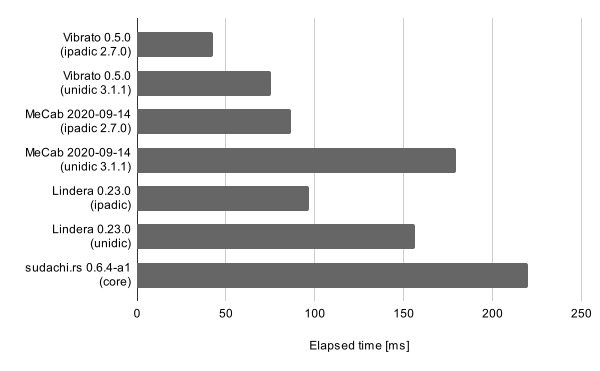

# 🎤 vibrato: VIterbi-Based acceleRAted TOkenizer

[](https://crates.io/crates/vibrato)
[](https://docs.rs/vibrato)


Vibrato is a fast implementation of tokenization (or morphological analysis) based on the Viterbi algorithm.

The technical ideas behind this library appear in [this blog post](https://tech.legalforce.co.jp/entry/2022/09/20/133132) (Japanese).

A Python wrapper is also available [here](https://github.com/daac-tools/python-vibrato).

[Wasm Demo](https://vibrato-demo.pages.dev/) (takes a little time to load the model.)

## Features

### Fast tokenization

Vibrato is a Rust reimplementation of the fast tokenizer [MeCab](https://taku910.github.io/mecab/),
although its implementation has been simplified and optimized for even faster tokenization.
Especially for language resources with a large matrix
(e.g., [`unidic-cwj-3.1.1`](https://clrd.ninjal.ac.jp/unidic/back_number.html#unidic_cwj) with a matrix of 459 MiB),
Vibrato will run faster thanks to cache-efficient id mappings.

For example, the following figure shows an experimental result of
tokenization time with MeCab and its reimplementations.
The detailed experimental settings and other results are available on [Wiki](https://github.com/daac-tools/vibrato/wiki/Speed-Comparison).



### MeCab compatibility

Vibrato supports options for outputting tokenized results identical to MeCab, such as ignoring whitespace.

### Training parameters

Vibrato also supports training parameters (or costs) in dictionaries from your corpora.
The detailed description can be found [here](./docs/train.md).

## Basic usage

This software is implemented in Rust.
First of all, install `rustc` and `cargo` following the [official instructions](https://www.rust-lang.org/tools/install).

### 1. Dictionary preparation

You can easily get started with Vibrato by downloading a precompiled dictionary.
[The Releases page](https://github.com/daac-tools/vibrato/releases) distributes
several precompiled dictionaries from different resources.

Here, consider to use [mecab-ipadic v2.7.0](https://taku910.github.io/mecab/).
(Specify an appropriate Vibrato release tag to `VERSION` such as `v0.4.0`.)

```
$ wget https://github.com/daac-tools/vibrato/releases/download/VERSION/ipadic-mecab-2_7_0.tar.xz
$ tar xf ipadic-mecab-2_7_0.tar.xz
```

You can also compile or train system dictionaries from your own resources.
See the [docs](./docs/) for more advanced usage.

### 2. Tokenization

To tokenize sentences using the system dictionary, run the following command.

```
$ echo '本とカレーの街神保町へようこそ。' | cargo run --release -p tokenize -- -i ipadic-mecab-2_7_0/system.dic.zst
```

The resultant tokens will be output in the Mecab format.

```
本	名詞,一般,*,*,*,*,本,ホン,ホン
と	助詞,並立助詞,*,*,*,*,と,ト,ト
カレー	名詞,固有名詞,地域,一般,*,*,カレー,カレー,カレー
の	助詞,連体化,*,*,*,*,の,ノ,ノ
街	名詞,一般,*,*,*,*,街,マチ,マチ
神保	名詞,固有名詞,地域,一般,*,*,神保,ジンボウ,ジンボー
町	名詞,接尾,地域,*,*,*,町,マチ,マチ
へ	助詞,格助詞,一般,*,*,*,へ,ヘ,エ
ようこそ	感動詞,*,*,*,*,*,ようこそ,ヨウコソ,ヨーコソ
。	記号,句点,*,*,*,*,。,。,。
EOS
```

If you want to output tokens separated by spaces, specify `-O wakati`.

```
$ echo '本とカレーの街神保町へようこそ。' | cargo run --release -p tokenize -- -i ipadic-mecab-2_7_0/system.dic.zst -O wakati
本 と カレー の 街 神保 町 へ ようこそ 。
```

## Tokenization options

### MeCab-compatible options

Vibrato is a reimplementation of the MeCab algorithm,
but with the default settings it can produce different tokens from MeCab.

For example, MeCab ignores spaces (more precisely, `SPACE` defined in `char.def`) in tokenization.

```
$ echo "mens second bag" | mecab
mens	名詞,固有名詞,組織,*,*,*,*
second	名詞,一般,*,*,*,*,*
bag	名詞,固有名詞,組織,*,*,*,*
EOS
```

However, Vibrato handles such spaces as tokens with the default settings.

```
$ echo 'mens second bag' | cargo run --release -p tokenize -- -i ipadic-mecab-2_7_0/system.dic.zst
mens	名詞,固有名詞,組織,*,*,*,*
 	記号,空白,*,*,*,*,*
second	名詞,固有名詞,組織,*,*,*,*
 	記号,空白,*,*,*,*,*
bag	名詞,固有名詞,組織,*,*,*,*
EOS
```

If you want to obtain the same results as MeCab, specify the arguments `-S` and `-M 24`.

```
$ echo 'mens second bag' | cargo run --release -p tokenize -- -i ipadic-mecab-2_7_0/system.dic.zst -S -M 24
mens	名詞,固有名詞,組織,*,*,*,*
second	名詞,一般,*,*,*,*,*
bag	名詞,固有名詞,組織,*,*,*,*
EOS
```

`-S` indicates if spaces are ignored.
`-M` indicates the maximum grouping length for unknown words.

#### Notes

There are corner cases where tokenization results in different outcomes due to cost tiebreakers.
However, this would be not an essential problem.

### User dictionary

You can use your user dictionary along with the system dictionary.
The user dictionary must be in the CSV format.

```
<surface>,<left-id>,<right-id>,<cost>,<features...>
```

The first four columns are always required.
The others (i.e., `<features...>`) are optional.

For example,

```
$ cat user.csv
神保町,1293,1293,334,カスタム名詞,ジンボチョウ
本とカレーの街,1293,1293,0,カスタム名詞,ホントカレーノマチ
ようこそ,3,3,-1000,感動詞,ヨーコソ,Welcome,欢迎欢迎,Benvenuto,Willkommen
```

To use the user dictionary, specify the file with the `-u` argument.

```
$ echo '本とカレーの街神保町へようこそ。' | cargo run --release -p tokenize -- -i ipadic-mecab-2_7_0/system.dic.zst -u user.csv
本とカレーの街	カスタム名詞,ホントカレーノマチ
神保町	カスタム名詞,ジンボチョウ
へ	助詞,格助詞,一般,*,*,*,へ,ヘ,エ
ようこそ	感動詞,ヨーコソ,Welcome,欢迎欢迎,Benvenuto,Willkommen
。	記号,句点,*,*,*,*,。,。,。
EOS
```

## More advanced usages

The directory [docs](./docs/) provides descriptions of more advanced usages such as training or benchmarking.

## Slack

We have a Slack workspace for developers and users to ask questions and discuss a variety of topics.

 * https://daac-tools.slack.com/
 * Please get an invitation from [here](https://t.co/ikroMYhRsm).

## License

Licensed under either of

 * Apache License, Version 2.0
   ([LICENSE-APACHE](LICENSE-APACHE) or http://www.apache.org/licenses/LICENSE-2.0)
 * MIT license
   ([LICENSE-MIT](LICENSE-MIT) or http://opensource.org/licenses/MIT)

at your option.

## Acknowledgment

The initial version of this software was developed by LegalOn Technologies, Inc.,
but not an officially supported LegalOn Technologies product.

## Contribution

See [the guidelines](./CONTRIBUTING.md).
